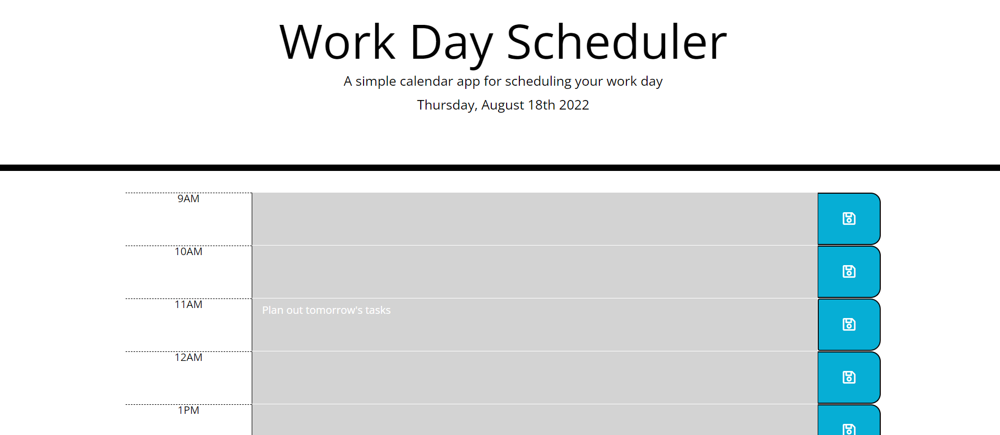

# Calendar-Day-Planner-Application

## Description

This is a daily workday planner that someone can fill out to plan out their work schedule.

It runs a script to populate different time blocks. There is an entry field in the middle of each of these that can be filled in with tasks and events to do. The timeblocks will also be color coordinated by the current hour, past hours and future hours.

If the user wants to save the information for future use, they can click the save button to update the information in the local storage so that it can be pulled up and updated later.

## Table of Contents

- [Development](#development)
- [Installation](#installation)
- [Usage](#usage)
- [License](#license)

## Development

1. I first needed to figure out how I was going to populate the information for the text blocks. This was done pulling and iterating an array.
2. I then needed to use moment() to display the date for the day being planned
3. Then I had to figure out which attributes to attach to each document. This was done by assigning attributes to each element in the row
4. To finish, the information had to be saved to the local storage. This was done by assigning the local storage on initialization and then locating which save button has been clicked and targeting the correct text area to save.

## Installation

To install this project, download the files from my repository at https://github.com/AndrewKamSki/Calendar-Day-Planner-Application. From there you can load in the html 
file in your favorite IDE along with the corresponding CSS and JS files. To see what the file looks like in a browser, open the index.html file in your browser.

## Usage

To use this tool for yourself, visit the depoloyed landing page at https://andrewkamski.github.io/Calendar-Day-Planner-Application/.

Upon opening, you can add text to the different text areas in the doc. To save the text to local storage, click the corresponding save button directly to the right of the text you want to save.

If you reload the page, the information should still display!

## License
MIT License

Copyright (c) [2022] [Andrew Kaminski]

Permission is hereby granted, free of charge, to any person obtaining a copy
of this software and associated documentation files (the "Software"), to deal
in the Software without restriction, including without limitation the rights
to use, copy, modify, merge, publish, distribute, sublicense, and/or sell
copies of the Software, and to permit persons to whom the Software is
furnished to do so, subject to the following conditions:

The above copyright notice and this permission notice shall be included in all
copies or substantial portions of the Software.

THE SOFTWARE IS PROVIDED "AS IS", WITHOUT WARRANTY OF ANY KIND, EXPRESS OR
IMPLIED, INCLUDING BUT NOT LIMITED TO THE WARRANTIES OF MERCHANTABILITY,
FITNESS FOR A PARTICULAR PURPOSE AND NONINFRINGEMENT. IN NO EVENT SHALL THE
AUTHORS OR COPYRIGHT HOLDERS BE LIABLE FOR ANY CLAIM, DAMAGES OR OTHER
LIABILITY, WHETHER IN AN ACTION OF CONTRACT, TORT OR OTHERWISE, ARISING FROM,
OUT OF OR IN CONNECTION WITH THE SOFTWARE OR THE USE OR OTHER DEALINGS IN THE
SOFTWARE.

## Future Development

The application is a good starting place for the app. Its primary weakness is that it only does a days worth of planning, while planning in advance days ahead can be much more useful.

Having this current html be a location.replace() doc could be useful if I created another document that used a calendar selection tool such as a jQuery widget